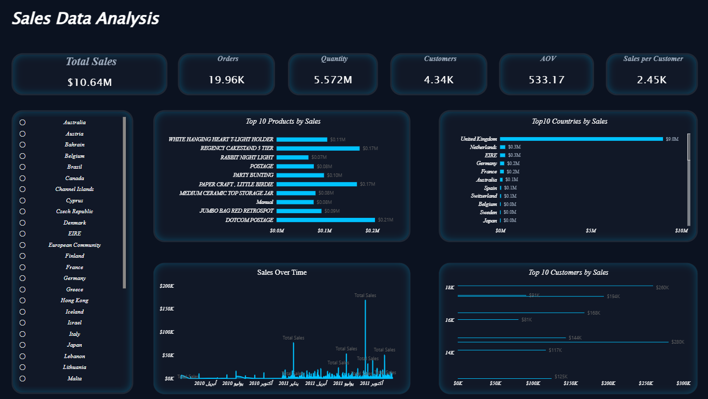

# Sales Data Analysis Dashboard (Power BI)

## Overview
This project focuses on analyzing sales data using Power BI to extract meaningful insights and support business decision-making.

## Key Features
- Data cleaning using Power Query  
- DAX calculations (Total Sales, Orders, AOV)  
- Interactive dashboard  

## Insights
- Top Products  
- Top Countries  
- Top Customers  
- Sales Over Time  

## Tools Used
- Power BI  
- Power Query  
- DAX  

## Author
Muhammad Ibrahim
